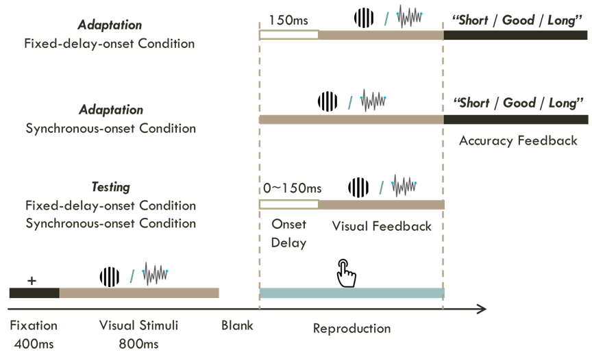

```{r setup, include=FALSE}
knitr::opts_chunk$set(echo = TRUE)
getwd()
```

```{r library, include=FALSE}
library(png)
library(tidyverse)
library(tidyr)
library(viridis)
library(hrbrthemes)
library(ez)
library(ggsignif)
library(rstatix)
library(cowplot)
library(lme4)      # Mixed-Effect-ANOVA
library(lmerTest)  # provides p-values for mixed-effects models
```

## Experiment Information

### Study Design

##### Exp 1 and 2


## Results

```{r, include=FALSE, warning=FALSE, error=FALSE}

# Import data
# only use the data of last 60 trials of adaptation session for each participant
data1 = read.csv("DataFile/rawdata_Exp1.csv")
data2 = read.csv("DataFile/rawdata_Exp2.csv")
data_sum = read.csv("DataFile/rawdata_Exp1and2.csv")

```

#### Exp 1 and 2
##### Bar plot
###### Adaptation only

```{r, echo=FALSE, warning=FALSE, error=FALSE, message=FALSE}

# -- Adaptation only --
plotsum_adpt <-  data_sum %>%
  group_by(Cond, BlockNo, Exp, SubID) %>%
  filter(BlockNo == 0) %>%
  summarise(Repo = mean(Reproduction)) %>% # within Subject mean
  group_by(Cond, Exp) %>% # 
  summarise(mRepo = mean(Repo), n = n(), se = sd(Repo)/sqrt(n)) %>% # overall mean
  ggplot(aes(x = Cond, mRepo, fill = Exp, color = Exp)) + # add color for error bar color
  geom_bar(stat = 'identity', color = "white", position = position_dodge(width = 0.7), width = 0.7) + 
  # add bar label of value
  geom_text(aes(label = round(mRepo, digits = 0)), vjust = 3, color = "white",
            position = position_dodge(0.7), size = 4) +
  geom_errorbar(aes(ymin = mRepo - se, ymax = mRepo + se), 
                position = position_dodge(width = 0.7), width = 0.4) +
  # use different colors
  scale_fill_manual(values = c("#31a354", "#d8b365"),
                     name = "Modality", labels = c("Visual", "Tactile")) +
  scale_color_manual(values = c("#31a354", "#d8b365"),
                     name = "Modality", labels = c("Visual", "Tactile")) +
  scale_x_discrete(labels = c("Delayed", "Synchronized")) + 
  coord_cartesian(ylim = c(500, 900)) +
  xlab('Session') +
  ylab('Mean Reproduction (ms)') + 
  theme_classic()
plotsum_adpt

# sig plot
# p > 0.05: °, p ≤ 0.05: *, p ≤ 0.01: **, p ≤ 0.001: ***
# Exp 1 + 2
plotsum_adpt_sig <- plotsum_adpt +
  geom_signif(y_position = 890, xmin = 1, xmax = 2, 
              annotation = "***", tip_length = 0.06, vjust = 0.4, textsize = 6, color = "black")
plotsum_adpt_sig

```

###### Test only

```{r, echo=FALSE, warning=FALSE, error=FALSE, message=FALSE}

# -- Test only --
plotsum_test <-  data_sum %>%
  group_by(Cond, TrialType, Exp, SubID) %>%
  filter(TrialType == 'test') %>%
  summarise(Repo = mean(Reproduction)) %>% # within Subject mean
  group_by(Cond, Exp) %>% # 
  summarise(mRepo = mean(Repo), n = n(), se = sd(Repo)/sqrt(n)) %>% # overall mean
  ggplot(aes(x = Cond, mRepo, fill = Exp, color = Exp)) + # add color for error bar color
  geom_bar(stat = 'identity', color = "white", position = position_dodge(width = 0.7), width = 0.7) + 
  # add bar label of value
  geom_text(aes(label = round(mRepo, digits = 0)), vjust = 3, color = "white",
            position = position_dodge(0.7), size = 4) +
  geom_errorbar(aes(ymin = mRepo - se, ymax = mRepo + se), 
                position = position_dodge(width = 0.7), width = 0.4) +
  # use different colors
  scale_fill_manual(values = c("#31a354", "#d8b365"),
                     name = "Modality", labels = c("Visual", "Tactile")) +
  scale_color_manual(values = c("#31a354", "#d8b365"),
                     name = "Modality", labels = c("Visual", "Tactile")) +
  scale_x_discrete(labels = c("Delayed", "Synchronized")) + 
  coord_cartesian(ylim = c(500, 1020)) +
  xlab('Session') +
  ylab('Mean Reproduction (ms)') + 
  theme_classic()
plotsum_test


# sig plot
# p > 0.05: °, p ≤ 0.05: *, p ≤ 0.01: **, p ≤ 0.001: ***
plotsum_test_sig <- plotsum_test +
  geom_signif(y_position = 1020, xmin = 1, xmax = 2, 
              annotation = "***", tip_length = 0.06, vjust = 0.4, textsize = 6, color = "black")
plotsum_test_sig

```

###### Sync only

```{r, echo=FALSE, warning=FALSE, error=FALSE, message=FALSE}

# -- Sync only --
plotsum_sync <- data_sum %>%
  group_by(Cond, TrialType, Exp, SubID) %>%
  filter(BlockNo == 0 | TrialType == 'test') %>%
  filter(Cond == 'sync') %>%
  filter(Dur == 0) %>%
  summarise(Repo = mean(Reproduction)) %>% # within Subject mean
  group_by(TrialType, Cond, Exp) %>% # 
  summarise(mRepo = mean(Repo), n = n(), se = sd(Repo)/sqrt(n)) %>% # overall mean
  ggplot(aes(x = TrialType, mRepo, fill = Exp, color = Exp)) + # add color for error bar color
  geom_bar(stat = 'identity', color = "white", position = position_dodge(width = 0.7), width = 0.7) + 
  # add bar label of value
  geom_text(aes(label = round(mRepo, digits = 0)), vjust = 3, color = "white",
            position = position_dodge(0.7), size = 4) +
  geom_errorbar(aes(ymin = mRepo - se, ymax = mRepo + se), 
                position = position_dodge(width = 0.7), width = 0.4) +
  # use different colors
  scale_fill_manual(values = c("#31a354", "#d8b365"),
                     name = "Modality", labels = c("Visual", "Tactile")) +
  scale_color_manual(values = c("#31a354", "#d8b365"),
                     name = "Modality", labels = c("Visual", "Tactile")) +
  scale_x_discrete(labels = c("Adaptation", "Test")) + 
  coord_cartesian(ylim = c(500, 1020)) +
  xlab('Phase\n\nSynchronized Feedback Session') +
  ylab('Mean Reproduction (ms)') + 
  theme_classic()
plotsum_sync

##### sig plot
# p > 0.05: °, p ≤ 0.05: *, p ≤ 0.01: **, p ≤ 0.001: ***
plotsum_sync_sig <- plotsum_sync +
  geom_signif(y_position = 1020, xmin = 1, xmax = 2, 
              annotation = "***", tip_length = 0.06, vjust = 0.4, textsize = 6, color = "black") +
  # Trialtype: test, Exp1 vs. Exp2
  geom_signif(y_position = c(1005, 1005), xmin = c(0.8, 1.8), xmax = c(1.2, 2.2), 
              annotation = c("", "       *"), 
              tip_length = 0, vjust = 0.4, textsize = 6, color = "black")
plotsum_sync_sig

```

###### Delay only

```{r, echo=FALSE, warning=FALSE, error=FALSE, message=FALSE}
# -- Delay only --
plotsum_delay <- data_sum %>%
  group_by(Cond, TrialType, Exp, SubID) %>%
  filter(BlockNo == 0 | TrialType == 'test') %>%
  filter(Cond == 'delay') %>%
  filter(Dur == 150) %>%
  summarise(Repo = mean(Reproduction)) %>% # within Subject mean
  group_by(TrialType, Cond, Exp) %>% # 
  summarise(mRepo = mean(Repo), n = n(), se = sd(Repo)/sqrt(n)) %>% # overall mean
  ggplot(aes(x = TrialType, mRepo, fill = Exp, color = Exp)) + # add color for error bar color
  geom_bar(stat = 'identity', color = "white", position = position_dodge(width = 0.7), width = 0.7) + 
  # add bar label of value
  geom_text(aes(label = round(mRepo, digits = 0)), vjust = 3, color = "white",
            position = position_dodge(0.7), size = 4) +
  geom_errorbar(aes(ymin = mRepo - se, ymax = mRepo + se), 
                position = position_dodge(width = 0.7), width = 0.4) +
  # use different colors
  scale_fill_manual(values = c("#31a354", "#d8b365"),
                     name = "Modality", labels = c("Visual", "Tactile")) +
  scale_color_manual(values = c("#31a354", "#d8b365"),
                     name = "Modality", labels = c("Visual", "Tactile")) +
  scale_x_discrete(labels = c("Adaptation", "Test")) + 
  coord_cartesian(ylim = c(500, 1020)) +
  xlab('Phase\n\nDelayed Feedback Session') +
  ylab('Mean Reproduction (ms)') + 
  # ggtitle("Delayed Feedback Session") +
  theme_classic()
plotsum_delay

##### sig plot
# p > 0.05: °, p ≤ 0.05: *, p ≤ 0.01: **, p ≤ 0.001: ***
plotsum_delay_sig <- plotsum_delay +
  geom_signif(y_position = 1020, xmin = 1, xmax = 2, 
              annotation = "***", tip_length = 0.06, vjust = 0.4, textsize = 6, color = "black")
plotsum_delay_sig
# ggsave(plotsum_delay_sig, file = './figures/M3/plotsum_delay_sig.png', width = 7, height = 5, units = "in")

# extract plotsum_delay_sig legend
legend_plot12 <- cowplot::get_legend(plotsum_delay_sig)

# combine plots: overestimation
plotsum_ds <- plot_grid(
  plot_grid(plotsum_sync_sig + theme(legend.position = "none"), NULL, 
            plotsum_delay_sig + theme(legend.position = "none"), legend_plot12,
            rel_widths = c(1, 0, 1, 0.2),
            nrow = 1, labels = c("A", "", "B", "")), rel_heights = c(1, 0.1, 1, 1))
plotsum_ds

```

###### Overestimation 

```{r, echo=FALSE, warning=FALSE, error=FALSE, message=FALSE}

# -- Overestimation --
# calculate overestion in sync only and adpt only
data_sum_sync <- data_sum %>%
  group_by(Cond, TrialType, Exp, Dur, SubID) %>%
  filter(BlockNo == 0 | TrialType == 'test') %>%
  filter(Cond == 'sync') %>%
  filter(Dur == 0) %>%
  summarise(Repo = mean(Reproduction)) %>%
  pivot_wider(names_from = TrialType, values_from = Repo) %>%
  mutate(Overest = test - adpt)

data_sum_delay <- data_sum %>%
  group_by(Cond, TrialType, Exp, Dur, SubID) %>%
  filter(BlockNo == 0 | TrialType == 'test') %>%
  filter(Cond == 'delay') %>%
  filter(Dur == 150) %>%
  summarise(Repo = mean(Reproduction)) %>%
  pivot_wider(names_from = TrialType, values_from = Repo) %>%
  mutate(Overest = test - adpt)

# combine dataframe
data_sum_overest <- rbind(data_sum_sync, data_sum_delay)

# plot
plotsum_overest <- data_sum_overest %>%
  group_by(Cond, Exp) %>% # 
  summarise(mOverest = mean(Overest), n = n(), se = sd(Overest)/sqrt(n)) %>% # overall mean
  ggplot(aes(x = Cond, mOverest, fill = Exp, color = Exp)) + # add color for error bar color
  geom_bar(stat = 'identity', color = "white", position = position_dodge(width = 0.7), width = 0.7) + 
  # add bar label of value
  geom_text(aes(label = round(mOverest, digits = 0)), vjust = 5, color = "white",
            position = position_dodge(0.7), size = 4) +
  geom_errorbar(aes(ymin = mOverest - se, ymax = mOverest + se), 
                position = position_dodge(width = 0.7), width = 0.4) +
  # use different colors
  scale_fill_manual(values = c("#31a354", "#d8b365"),
                     name = "Modality", labels = c("Visual", "Tactile")) +
  scale_color_manual(values = c("#31a354", "#d8b365"),
                     name = "Modality", labels = c("Visual", "Tactile")) +
  scale_x_discrete(labels = c("Delayed", "Synchronized")) + 
  coord_cartesian(ylim = c(8, 180)) +
  xlab('Session') +
  ylab('Mean Overestimation (ms)') + 
  theme_classic()
plotsum_overest

##### sig plot
# p > 0.05: °, p ≤ 0.05: *, p ≤ 0.01: **, p ≤ 0.001: ***
plotsum_overest_sig <- plotsum_overest +
  geom_signif(y_position = c(135, 175), xmin = c(0.8, 1.8), xmax = c(1.2, 2.2), 
              annotation = c("**", "**"), tip_length = 0.0, vjust = 0.4, textsize = 6, color = "black")
plotsum_overest_sig

```

###### Between session comparison 

```{r, echo=FALSE, warning=FALSE, error=FALSE, message=FALSE}
# -- Overestimation --
# calculate between session differences
data_sum_session <- data_sum %>%
  group_by(Cond, TrialType, Exp, SubID) %>%
  filter(BlockNo == 0 | TrialType == 'test') %>%
  summarise(Repo = mean(Reproduction)) %>%
  pivot_wider(names_from = Cond, values_from = Repo) %>%
  mutate(SessDiff = sync - delay)

# set different vjust for bar numbers
data_sum_session$Vjust <- ifelse(data_sum_session$TrialType == "adpt", -3.5 , 4.5)

# plot
plotsum_session <- data_sum_session %>%
  group_by(TrialType, Exp, Vjust) %>% # 
  summarise(mSessDiff = mean(SessDiff), n = n(), se = sd(SessDiff)/sqrt(n)) %>% # overall mean
  ggplot(aes(x = TrialType, mSessDiff, fill = Exp, color = Exp)) + # add color for error bar color
  geom_bar(stat = 'identity', color = "white", position = position_dodge(width = 0.7), width = 0.7) + 
  # add bar label of value
  geom_text(aes(label = round(mSessDiff, digits = 0), vjust = Vjust), color = "white",
            position = position_dodge(0.7), size = 4) +
  geom_errorbar(aes(ymin = mSessDiff - se, ymax = mSessDiff + se), 
                position = position_dodge(width = 0.7), width = 0.4) +
  # use different colors
  scale_fill_manual(values = c("#31a354", "#d8b365"),
                     name = "Modality", labels = c("Visual", "Tactile")) +
  scale_color_manual(values = c("#31a354", "#d8b365"),
                     name = "Modality", labels = c("Visual", "Tactile")) +
  scale_x_discrete(labels = c("Adaptation", "Test")) + 
  coord_cartesian(ylim = c(-80, 140)) +
  xlab('Phase') +
  ylab('Between Session Difference (ms)') + 
  theme_classic()
plotsum_session


##### sig plot
# p > 0.05: °, p ≤ 0.05: *, p ≤ 0.01: **, p ≤ 0.001: ***
plotsum_session_sig <- plotsum_session +
  geom_signif(y_position = 135, xmin = 1, xmax = 2, 
              annotation = "***", tip_length = 0.02, vjust = 0.4, textsize = 6, color = "black")
plotsum_session_sig

```

##### Line plot

```{r, echo=FALSE, warning=FALSE, error=FALSE, message=FALSE}

# grouping by Dur
# with regression lines
# summarize dateframe prior to keep the ploting section clean and short
data_lm <- data_sum %>%
  group_by(Dur, Cond, TrialType, Exp, SubID) %>%
  filter(TrialType == 'test') %>%
  summarise(mRepo = mean(Reproduction), n = n(), se = sd(Reproduction)/sqrt(n))

data_madpt = data_sum %>% 
  filter(TrialType == "adpt", Epoch <= 4) %>%
  group_by(Dur, Cond, Exp) %>%
  summarise(mRepo = mean(Reproduction), n = n(), se = sd(Reproduction)/sqrt(n))

data_sumplot <- data_sum %>%
  group_by(Dur, Cond, TrialType, Exp) %>% 
  filter(TrialType == 'test') %>%
  summarise(mRepo = mean(Reproduction), n = n(), se = sd(Reproduction)/sqrt(n),
            # set different vjust for text lables
            vjust_lable = case_when(Dur == 150 ~ -1.2,
                                    Dur == 100 ~ 1,
                                    Dur == 50 & Exp == "Exp2" ~ 1,
                                    Dur == 50 & Exp == "Exp4" ~ 2,
                                    Dur == 0 & Exp == "Exp2" ~ 0.5,
                                    Dur == 0 & Exp == "Exp4" ~ 1.5))
  
lineplot_sum_lm <- data_sumplot %>%
  ggplot(aes(Dur, mRepo, group = interaction(Cond, Exp), color = Exp)) +
  # errorbar, width for bar width, size for line width
  geom_errorbar(aes(ymin = mRepo-se, ymax = mRepo+se), width = 3, size = 0.4) + 
  # geom_line(aes(linetype = Cond, color = Exp), show.legend = TRUE) +
  geom_point(aes(color = Exp)) +
  scale_linetype_manual(values = c("solid", "longdash"),
                        name = "Delay", labels = c("Delayed", "Synchronized")) +
  scale_color_manual(values = c("#31a354", "#d8b365"),
                     name = "Modality", labels = c("Visual", "Tactile")) +
  geom_text(aes(label = round(mRepo, digits = 0), vjust = vjust_lable), hjust = -0.3,
            position = position_dodge(0.7), size = 4) +
  # mean point
  stat_summary(fun.y = mean, geom = "point", shape = 18, size = 3) +
  # # add mean adaptation dots
  geom_point(data = data_madpt, aes(Dur, mRepo, color = Exp), size = 2, shape = 5) +
  geom_text(data = data_madpt, aes(label = round(mRepo, digits = 0), vjust = 0), hjust = -0.3,
            position = position_dodge(0.7), size = 4) +
  geom_errorbar(data = data_madpt, aes(ymin = mRepo-se, ymax = mRepo+se), width = 3, size = 0.4) + 
  # add regression lines
  geom_smooth(data = data_lm, method = lm, aes(linetype = Cond, color = Exp), size = 0.6, se = TRUE) +
  facet_wrap(~ Exp) +
  coord_cartesian(xlim = c(0, 160)) +
  xlab('Delay (ms)') +
  ylab('Mean Reproduction (ms)') + 
  theme_classic()
lineplot_sum_lm

```


### Analysis
#### ANOVA
##### Exp 1

```{r, warning=FALSE, message=FALSE, error=FALSE}
# -- convert to factors --
data1$Cond <- as.factor(data1$Cond)
data1$TrialType <- as.factor(data1$TrialType)

# -- calculate --
# Do ANOVA separately (not 2 * 2 * 5)
# The onset delay has only 2 levels (0 & 150) in adaptation
# but 4 levels (0, 50, 100, 150) in testing

# Cond & Dur
# test phase only
output1_cd <- ezANOVA(data = data1 %>% 
                     filter(TrialType == 'test'),
                   dv = .(Reproduction), 
                   within = .(Cond, Dur), 
                   wid = .(SubID))
output1_cd

```

##### Exp 2

```{r, warning=FALSE, message=FALSE, error=FALSE}
# -- convert to factors --
data2$Cond <- as.factor(data2$Cond)
data2$TrialType <- as.factor(data2$TrialType)

# -- calculate --
# Cond & Dur
output2 <- ezANOVA(data = data2 %>% 
                     filter(TrialType == 'test'),
                   dv = .(Reproduction), 
                   within = .(Cond, Dur), 
                   wid = .(SubID))
output2

```

##### Exp 1 and 2

```{r, warning=FALSE, message=FALSE, error=FALSE}
# -- convert to factors --
data12 <- rbind(data1, data2)
data12$Cond <- as.factor(data12$Cond)
data12$Exp <- as.factor(data12$Exp)

# -- calculate --
# - Cond & Exp -
# Adptation
output12_adpt <- ezANOVA(data = data12 %>% 
                           filter(BlockNo == 0),
                         dv = .(Reproduction), 
                         within = .(Cond), 
                         between = .(Exp),
                         wid = .(SubID))
output12_adpt

# Test
output12_test <- ezANOVA(data = data12 %>% 
                           filter(TrialType == 'test'),
                         dv = .(Reproduction), 
                         within = .(Cond), 
                         between = .(Exp),
                         wid = .(SubID))
output12_test

# - TrialType & Exp -
# Sync
output12_sync <- ezANOVA(data = data12 %>% 
                           filter(BlockNo == 0 | TrialType == 'test') %>%
                           filter(Cond == 'sync' & Dur == 0),
                         dv = .(Reproduction), 
                         within = .(TrialType), 
                         between = .(Exp),
                         wid = .(SubID))
output12_sync

# Post-hoc t
# Cond = sync, Phase = test, Exp1 vs Exp2
tExp12_syncT <- t.test(Repo ~ Exp,
                       data = data12 %>% 
                         filter(TrialType == 'test' & Cond == 'sync' & Dur == 0) %>%
                         group_by(Exp, SubID) %>%
                         summarise(Repo = mean(Reproduction)), 
                       paired = TRUE)
tExp12_syncT

# Delay
output12_delay <- ezANOVA(data = data12 %>% 
                            filter(BlockNo == 0 | TrialType == 'test') %>%
                            filter(Cond == 'delay' & Dur == 150),
                          dv = .(Reproduction), 
                          within = .(TrialType), 
                          between = .(Exp),
                          wid = .(SubID))
output12_delay

# Overestimation
output12_overest <- ezANOVA(data = data_sum_overest,
                            dv = .(Overest),
                            within = .(Cond), 
                            between = .(Exp),
                            wid = .(SubID))
output12_overest

```


#### Between Exp comparison
##### ezANOVA
```{r, warning=FALSE, message=FALSE, error=FALSE}
# -- convert to factors --
data_sum$Cond <- as.factor(data_sum$Cond)
data_sum$TrialType <- as.factor(data_sum$TrialType)

# -- calculate --
# Cond & TrialType
outputsum_ct <- ezANOVA(data = data_sum %>% 
                     filter(BlockNo == 0 | TrialType == 'test'),
                   dv = .(Reproduction), 
                   within = .(Cond, TrialType), 
                   between = .(Exp),
                   wid = .(SubID))
outputsum_ct

# t.test
# Trialtype = adpt, Cond == delay
tExp12_adpt_delay <- t.test(Repo ~ Exp, data = data_sum %>% 
                              filter(Cond == "delay") %>%
                              filter(BlockNo == 0) %>%
                              group_by(Exp, SubID) %>%
                              summarise(Repo = mean(Reproduction)), paired = TRUE)
tExp12_adpt_delay

# - between session comparison -
outputsum_ses <- ezANOVA(data = data_sum_session,
                         dv = .(SessDiff),
                         within = .(TrialType),
                         between = .(Exp),
                         wid = .(SubID))
outputsum_ses

```

###### Linear mixed model
```{r, warning=FALSE, message=FALSE, error=FALSE}
datasum_test <- data_sum %>%
  group_by(TrialType, Cond, Exp, Dur, SubID) %>%
  filter(TrialType == "test") %>% 
  summarise(repo = mean(Reproduction))

datasum_test$Session = case_when(datasum_test$Cond == "sync" ~ 1, datasum_test$Cond == "delay" ~ 0)
           

# Fit the mixed-effects ANOVA model
# Visual
fitmodel_visual <- lmer(repo ~ Dur + Session + (1 | SubID), data = datasum_test %>% filter(Exp == "Exp1"))
# Tactile
fitmodel_tactile <- lmer(repo ~ Dur + Session + (1 | SubID), data = datasum_test %>% filter(Exp == "Exp2"))

# Print model summary to examine main effects and interactions
fitmodel_Vsummary <- summary(fitmodel_visual)
fitmodel_Tsummary <- summary(fitmodel_tactile)
fitmodel_Vsummary
fitmodel_Tsummary

# ANOVA
fitmodel_Vano <- anova(fitmodel_visual)
fitmodel_Tano <- anova(fitmodel_tactile)
fitmodel_Vano
fitmodel_Tano
tidy(fitmodel_Vano)
tidy(fitmodel_Tano)
```

#### ANCOVA

```{r, warning=FALSE, message=FALSE, error=FALSE}
# -- convert to factors --
data1$Cond <- as.factor(data1$Cond)
data1$TrialType <- as.factor(data1$TrialType)
data2$Cond <- as.factor(data2$Cond)
data2$TrialType <- as.factor(data2$TrialType)

# -- calculate --
# x1: Cond (sync / delay), x2: TrialType (adpt / test)
# y: Reproduction, z: Dur (0, 50, 100, 150)

# Exp 1
output1_ac <- lm(Reproduction ~ Cond * TrialType + Dur, data = data1)
output1_ac
summary(output1_ac)

# Exp 2
output2_ac <- lm(Reproduction ~ Cond * TrialType + Dur, data = data2)
output2_ac
summary(output2_ac)

```
